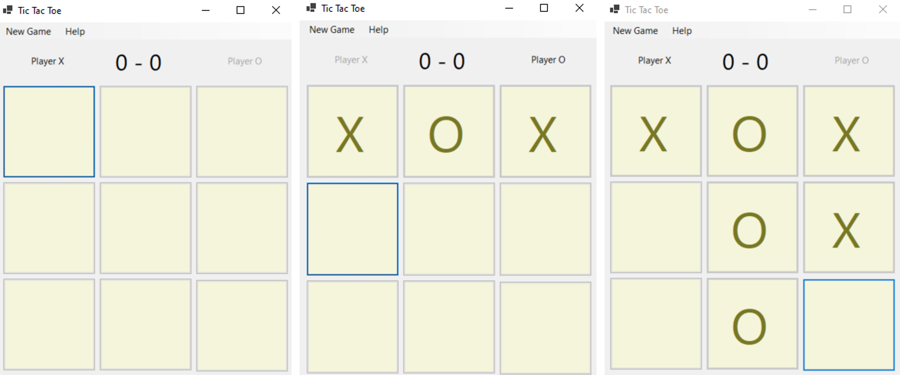
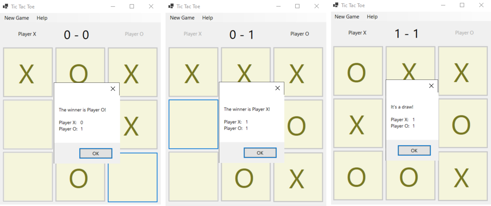
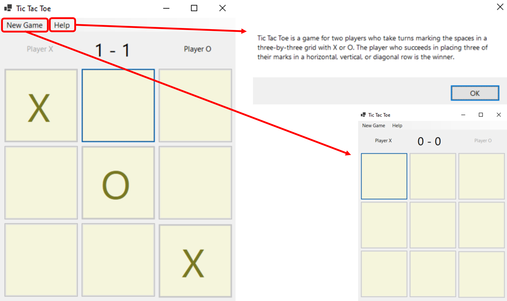

# tic-tac-toe
A game of tic-tac-toe? Created on C# 10 .NET 6.0 with option to play on CLI or Windows UI.

## Getting Started
To play the game you can simply clone this repo and then click on the shortcut (to the .exe file) located in:
 ``...\tic-tac-toe\tic-tac-toe-game``

## WinForm UI
The GUI was created using WinForm on .NET


#### Gameplay



#### Win, Lose & Draw prompts



#### Menu bar items



## Class Structure
```
Class Library
│   Game.cs
│   Game.cs
│   Piece.cs    
│   Player.cs
└───

CLI Game
│   Program.cs
└───

Windows Form
│   Program.cs
└───
```